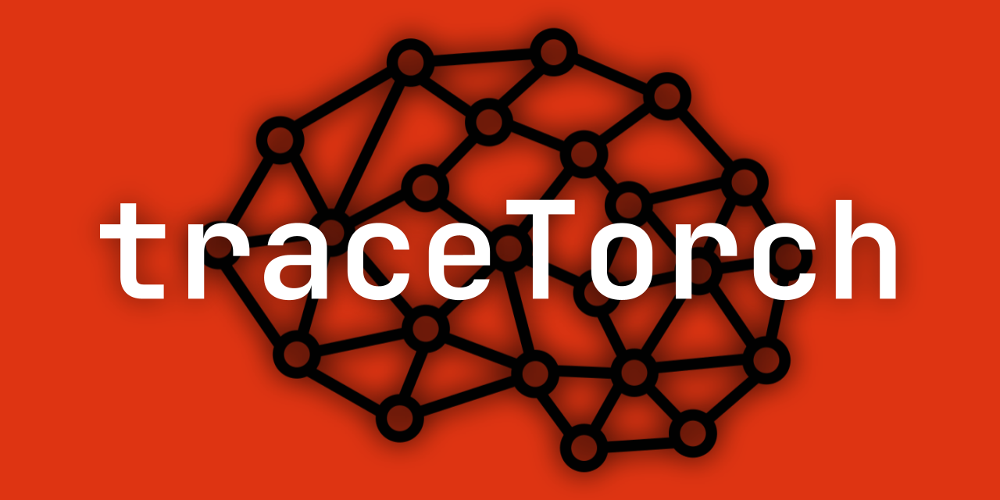

[](https://yegor-men.github.io/tracetorch/)
[](https://opensource.org/license/mit)
[](https://pypi.org/project/tracetorch/)

# traceTorch

A strict, ergonomic, and powerful Spiking Neural Network (SNN) library for PyTorch.

traceTorch employs a two-tier architecture that balances computational efficiency with maximum flexibility. As with any
other library, traceTorch presents a wide and powerful variety of distinct, commonly used neuron types utilizing
sensible defaults. The naming schema is consistent (albeit a bit unconventional) and self-explanatory. Together, these
layers provide control over a vast amount of neuron mechanics:

- `LI` base name stands for `Leaky Integrator`, the simplest of layer types with just one trace: the membrane potential
  which is the direct output, no firing; commonly known as `Readout`, although it's not recommended to literally make
  it the last layer.
- `~B` suffix stands for `Binary`, the presence of a threshold, meaning that the layer has 2 possible outputs: a 0 or 1.
- `~T` suffix stands for `Ternary`, meaning that the layer has 2 thresholds: a positive and negative one, and thus 3
  possible outputs: -1, 0 or 1.
- `~S` suffix stands for `Scaled`, meaning that the outputs are multiplicatively scaled separately based on their
  polarity, used to make ternary outputs truly independent of each other.
- `D~` prefix stads for `Dual`, meaning that all hidden states and parameters are split into a separate positive and
  negative version for greater expressivity and making polarity as a separate, alternate signal.
- `S~` prefix stands for `Synaptic`, meaning that before the membrane there is a separate synaptic trace smoothing out
  the inputs over time before they get integrated into the membrane.
- `R~` prefix stands for `Recurrent`, meaning that the layer records its own outputs into a separate trace and
  re-integrates it back into the membrane.

In total, this results in 32 specially made, performant layers which easily integrate and work with other PyTorch
layers: `LI`, `LIB`, `LIT`, `LITS`, `DLI`, `DLIB`, `DLIT`, `DLITS`, `SLI`, `SLIB`, `SLIT`, `SLITS`, `RLI`, `RLIB`,
`RLIT`, `RLITS`, `DSLI`, `DLIB`, `DSLIT`, `DSLITS`, `DRLI`, `DRLIB`, `DRLIT`, `DRLITS`, `SRLI`, `SRLIB`, `SRLIT`,
`SRLITS`, `DSRLI`, `DSRLIB`, `DSRLIT`, `DSRLITS`.

traceTorch also handles hidden state management in an easy-to-use way. They are set to `None`, and then the size is
lazily assigned based on the forward pass. Simply inherit from the `TTModule` class to gain access to powerful recursive
methods `.zero_states()` and `.detach_states()` to recursively respectively set the states to `None` or to detach, no
matter how deeply hidden they are: PyTorch modules such as `nn.Sequential` or python classes and data structures; it
doesn't matter. Additionally, traceTorch takes care of:

- Rank-based parameter scoping for per-layer (scalar) or per-neuron (vector) parameters, defaulting to per-neuron.
- Initialize parameters via a float value or your own desired tensor.
- Make any parameter learnable or static, automatically set to an `nn.Parameter` or registered buffer accordingly.
- Single `dim=` argument determines the target dimension the layer focuses on: `-1` for MLP, `-3` for CNN, et cetera.
- Smooth parameter constraints for those that require it (sigmoid on decays and softplus on thresholds), meaning that
  gradients always flow cleanly and accurately. The respective inverse function is applied if necessary during
  initialization.

But overarching this, traceTorch also presents one unified architecture, replacing the restrictive layer zoo of
countless disjoint neuron types with the `LeakyIntegrator` superclass. This design encapsulates the massive range of
possible dynamics into declarative configuration on one class, resulting in thousands of possible combinations of
features. All 32 of the layers also exist in the `LeakyIntegrator` form, and tests assert that the behavior of the two
versions don't differ.

Subsequently, traceTorch also presents the `LayerMixin`, a powerful mixin class that handles all the boilerplate of
creating SNN layers. Instead of wrestling with parameter registration, state management, and dimension handling, you can
just inherit from `LayerMixin` to create your own SNN layers that comply with the traceTorch ethos. It handles:

- **Automatic parameter registration**: handles ranks, learnability, value / tensor initialization and inverse functions
  for decays and thresholds.
- **State management for hidden states**: methods to bulk zero / detach / initialize hidden states for the layer (
  `TTModule` is for working with the layers in a model, `LayerMixin` is for managing the states in the layer itself).
- **Dimension helpers**: methods to move a tensor's dimension (the `dim=` used during initialization) to the last
  dimension so that the layer is tensor shape agnostic.
- **Property generation**: parameters are saved in `raw_*` form to account for inverse and activation functions, but
  work intuitively such that `layer.beta` returns the sigmoid activated value, et cetera.

In short, traceTorch exists to make writing, reading, debugging, and most importantly: experimenting, with SNNs in
PyTorch to feel significantly more natural and less frustrating than in existing alternatives, while preserving (and in
many cases enhancing) the expressive power needed for real models and research. It presents ready to use SNN layers,
a powerful superclass for experimenting with SNN dynamics, and the necessary foundation so that you can make your own
SNN layers too. traceTorch ultimately rewards users who value minimalism, composition, and long-term extensibility.

## Documentation

The online documentation can be found [here](https://yegor-men.github.io/tracetorch/). It is thoroughly recommended to
at least read the introduction section before proceeding as it contains the theory behind SNNs, the traceTorch ethos and
layers available as well as a brief explanation of what it is that each mechanic actually does. It also contains a
couple tutorials to recreate the code found in `examples/`.

## Installation

traceTorch is a PyPI library found [here](https://pypi.org/project/tracetorch/). Requirements for the library are listed
in `requirements.txt`. Take note that examples found in `examples/` may have their own requirements, separate from the
library requirements.

```bash
pip install tracetorch
```

If you don't want to install traceTorch as a library, or just want to test the examples, you should install traceTorch
as an editable installation:

```bash
git clone --branch v0.10.0 https://github.com/Yegor-men/tracetorch
cd tracetorch
pip install -e .
```

Make sure to check the [releases](https://github.com/Yegor-men/tracetorch/releases) page for the latest (or different)
version number if you want a different release.

## Quickstart

traceTorch models look barely any different from PyTorch models:

```python
import torch
from torch import nn
import tracetorch as tt
from tracetorch import snn

device = "cuda" if torch.cuda.is_available() else "cpu"


class SNN(snn.TTModule):
    def __init__(self):
        super().__init__()
        self.net = nn.Sequential(
            nn.Conv2d(1, 32, 3, padding=1),
            snn.LIF(16, dim=-3),
            nn.MaxPool2d(2, 2),
            nn.Conv2d(32, 64, 3, padding=1),
            snn.LIF(64, dim=-3),
            nn.MaxPool2d(2, 2),
            nn.Flatten(),
            nn.Linear(7 * 7 * 64, 128),
            snn.LI(128),
            nn.Linear(128, 10)
        )

    def forward(self, x):
        return self.net(x)


model = SNN().to(device)
optimizer = torch.optim.AdamW(model.parameters(), 1e-3)

# TRAINING LOOP WITH DATALOADER
model.train()
for x, y in train_dataloader:
    model.zero_states()  # sets hidden states to None for lazy assignment
    model.zero_grad()
    running_loss = 0.0
    for t in range(num_timesteps):
        model_output = model(x[t])
        loss = loss_fn(model_output, y[t])
        running_loss = running_loss + loss
        # optionally call model.detach_states() for online learning here
    running_loss.backward()
    optimizer.step()
```

## Examples

Example code can be found in `examples/`. To test the code, make sure that you have the respective requirements
installed for the example, and that you've either installed traceTorch from PyPI or as an editable installation.

## Authors

- [@Yegor-men](https://github.com/Yegor-men)

## Contributing

Contributions are always welcome. Feel free to fork, submit pull requests or report issues, I will occasionally check in
on it.

## Roadmap

traceTorch still has a long way to go. Namely:

- Finish the rest of the 32 base classes
- Rewrite `LeakyIntegrator` to account for duality
- Finish the rest of the 32 base classes for tests in `snn.flex`
- Create tests to assert working order
- Finish the `examples/` section for example code
- Make proper requirements for each example in `examples/`
- Finish the `introduction/` section of the docs
- Do the `reference/` section for the docs
- Do the `tutorials/` section for the docs, basing it on the `examples/`
- Make docstrings
- Figure out versioning requirements for the library