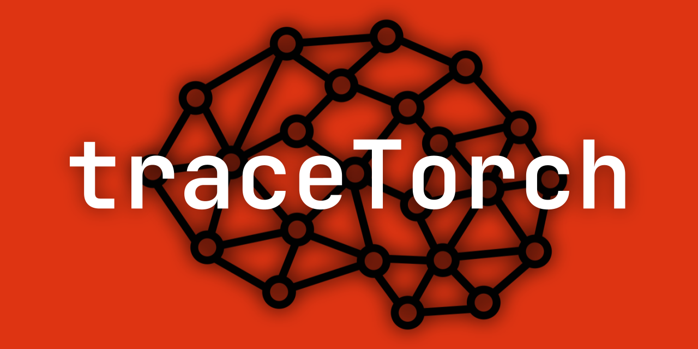

[](https://yegor-men.github.io/tracetorch/)
[](https://opensource.org/license/mit)
[](https://pypi.org/project/tracetorch/)

# traceTorch

A strict, ergonomic, and powerful library for SNNs, RNNs and SSMs in PyTorch.

Table of contents:

- [Introduction](#introduction)
- [Features](#features)
- [Documentation](#documentation)
- [Installation](#installation)
- [Quickstart](#quickstart)
- [Examples](#examples)
- [Authors](#authors)
- [Contributing](#contributing)
- [Roadmap](#roadmap)

## Introduction

traceTorch is a unified library for a wide array of recurrent networks in PyTorch: Spiking Neural Networks (SNNs),
classic Recurrent Neural Networks (RNNs) and the modern State Space Models (SSMs). traceTorch enforces a simple, albeit
slightly unorthodox rule that should have been the default all along: hidden states stay hidden. But that's not to
say that they're inaccessible. On the contrary, traceTorch is designed to make state management easier than ever. They
are lazily created in the forward pass, work with any target dimension, and most importantly are easy to clear, detach,
and even save and load. traceTorch makes it easy for you to mix and mash recurrent layers with any other PyTorch layer.
Take a look at the [quickstart](#quickstart) section to see how the code looks like.

The library initially started as one focused on SNNs. With a slightly unorthodox, but consistent and self-explanatory
naming schema, traceTorch presents 32 distinct SNN layer types built around the Leaky Integrator, and encapsulate a wide
range of dynamics: duality (splitting positive and negative signals); recurrence; synapse (an extra EMA accumulator
before the membrane); binary, ternary, scaled ternary, or no spiking for the output at all. The resulting 32 layers
encapsulate a whopping range of possible dynamics: `LI`, `DLI`, `SLI`, `DSLI`, `LIEMA`, `DLIEMA`, `SLIEMA`, `DSLIEMA`
`LIB`, `DLIB`, `SLIB`, `RLIB`, `DSLIB`, `DRLIB`, `SRLIB`, `DSRLIB`, `LIT`, `DLIT`, `SLIT`, `RLIT`, `DSLIT`, `DRLIT`,
`SRLIT`, `DSRLIT`, `LITS`, `DLITS`, `SLITS`, `RLITS`, `DSLITS`, `DRLITS`, `SRLITS`, `DSRLITS`.

But thinking a bit outside the box, and it becomes obvious that State Space Models (SSMs) such as Mamba, are incredibly
similar to the Leaky Integrator that all the SNN layers were built around, albeit a bit more complex. Subsequently, the
philosophy was then extended to the classic RNN layers: `SimpleRNN`, `LSTM`, `GRU`; as well as SSMs: `SelectiveSSM`,
`SpikeSSM`, `SelectiveZOHSSM`, and more to come.The result is an opinionated but extremely ergonomic extension to
PyTorch that rethinks the way that RNNs are made: no matter the architecture, it's all just another PyTorch-esque layer
that can be placed anywhere.

The main advantage and selling point of traceTorch is with how it manages hidden states. Inheriting from `tt.Model`
grants access to powerful recursive methods that handle all the boilerplate of state management: `zero_states()` and
`detach_states()`, `save_states()` and `load_states()`, no matter how deeply hidden they are. For some networks, some
parameters aren't used in their raw form, but instead need to be passed through an activation function of sorts, and to
skip this redundant calculation for a trained model, the module also presents `TTcompile()` and `TTdecompile()`.

But if you're dissatisfied with the range of layers, then making your own ones is also incredibly easy. Inheriting from
`tt.Layer` (or the downstream `tt.rnn.Layer` or `tt.snn.Layer` or `tt.ssm.Layer`) allows you to easily create layers
that integrate with the rest of the traceTorch ecosystem: making so that their hidden states are accessible and are
created to the proper shape; parameters can be compiled and initialization handles learnability, rank and/or a custom
tensor; helper methods to move a target dimension in and out for accessibility.

All in all, traceTorch exists to make writing, reading, debugging, and most importantly: experimenting, with recurrent
networks in PyTorch to feel significantly more natural and less frustrating, while preserving (and in many cases
enhancing) the expressive power needed for real models and research. traceTorch ultimately rewards users who value
minimalism, composition, and long-term extensibility.

## Features

As mentioned before, traceTorch currently has three main focal points for recurrent networks: SNNs which can be found in
`tt.snn`, RNNs which can be found in `tt.rnn`, and SSMs which can be found in `tt.ssm`. Regardless of where the layer
comes from though, it's inevitably a child of `tt.Layer`, which makes it integrate with `tt.Model` and all other PyTorch
modules in a layer-like way. This means that the layers expect one input, and produce only one output. All hidden states
stay hidden, internal to the layer. And it's just one layer, not a full multi-layer model. Subsequently, the design
approach changes a bit: the model processes one timestep at a time, it's expected that the looping is done externally.

As stated earlier, the main selling point of traceTorch is in that it handles all the state management boilerplate. A
model inheriting from `tt.Model` means access to predominantly the `zero_states()` and `detach_states()` methods.
Both of them recursively search everywhere for where the `tt.Layer` layers can be hidden, and either set to `None`
or detach accordingly. At the time of writing, `save_states()` and `load_states()` methods are experimental, but they
allow to save and load the hidden states to `.pt` or `.safetensors` in the same way that you could save the entire
model, but as a separate file. There are also the experimental `TTcompile` and `TTdecompile` methods which optimize
specific parameters that are always passed through an activation function of sorts so that instead they're stored as the
direct values instead: to be used when a model is trained and you don't want to waste compute by re-calculating the
effective values each time.

Speaking of layers, at the time of writing, traceTorch has a total of 36. `tt.rnn` is a fair bit smaller and more
self-explanatory. It includes: `SimpleRNN`, `LSTM`, `GRU`, with more to come (probably). The implementations are
standard considering the "one timestep at a time" and "as a layer" rules. `tt.ssm` is currently in development and is
rather experimental, the only real layer that works well is `SelectiveSSM`; in the future, `Mamba`, `S4` and others will
be added. However, `tt.snn` layers are a lot more extensive, and follow a slightly unconventional, but consistent and
self-explanatory naming schema. The names are modular and explain their role and function.

- `LI` base name stands for `Leaky Integrator`: the simplest of layer types with just one trace and decay: the membrane
  potential and the beta decay. No firing and no reset mechanics, this layer type is commonly known as `Readout` (
  although it's not recommended to literally have it as the final layer).
- `~EMA` suffix is only used with the `LI` type of neurons, and it makes the membrane act as an exponential moving
  average (EMA). This isn't useful in classification where you explicitly train the model return large magnitudes of
  values, but it's useful in other cases where the membrane magnitude need to be stable.
- `~B` suffix stands for `Binary`, the presence of a strictly positive threshold, meaning that the layer has 2 possible
  outputs: a 1 or a 0. `LIB` is hence the official name for the `LIF`.
- `~T` suffix stands for `Ternary`, meaning that the layer has 2 thresholds: a strictly positive and a strictly negative
  one, meaning that the layer has 3 possible outputs: 1, 0 or -1.
- `~S` suffix is only used with the `~T` suffix to create `~TS`, which stands for `Ternary Scaled`, meaning that the
  ternary outputs are multiplicatively separately scaled based on their polarity. This is done so that the three
  possible outputs are truly independent when we consider the downstream layer.
- `D~` prefix stads for `Dual`, meaning that all traces (hidden states) and their decay parameters are split into a
  separate positive and negative version for greater expressivity and unlocking more complex dynamics.
- `S~` prefix stands for `Synaptic`, meaning that before the membrane there is a separate synaptic trace with its
  respective alpha decay that smooth out the inputs over time via an EMA before they get integrated into the membrane.
- `R~` prefix stands for `Recurrent`, meaning that the layer records its own outputs into a separate trace with its own
  gamma decay and re-integrates it back into the membrane in the next timestep. The computation graph is made to work
  even with online learning.

In total, this results in 32 specially made, performant layers which easily integrate and work with other PyTorch
layers: `LI`, `DLI`, `SLI`, `DSLI`, `LIEMA`, `DLIEMA`, `SLIEMA`, `DSLIEMA` `LIB`, `DLIB`, `SLIB`, `RLIB`, `DSLIB`,
`DRLIB`, `SRLIB`, `DSRLIB`, `LIT`, `DLIT`, `SLIT`, `RLIT`, `DSLIT`, `DRLIT`, `SRLIT`, `DSRLIT`, `LITS`, `DLITS`,
`SLITS`, `RLITS`, `DSLITS`, `DRLITS`, `SRLITS`, `DSRLITS`.

Additionally, all the layers handle some extra boilerplate with parameter initialization and hidden state management,
all thanks to the `tt.Layer` superclass and the downstream SNN, RNN and SSM variants of it (`tt.snn.Layer`,
`tt.rnn.Layer`, `tt.ssm.Layer`):

- Rank-based parameter scoping for a per-layer (scalar) or per-neuron (vector) parameters, defaulting to per-neuron.
- Initialize parameters via a float value or your own desired tensor.
- Make any parameter learnable or static, automatically set to an `nn.Parameter` or registered buffer accordingly. This
  is _not_ applicable for some parameters, such as the linear layers inside `tt.rnn.GRU` for example.
- Smooth parameter constraints for those that require it (sigmoid on decays and softplus on thresholds for SNN layers),
  meaning that gradients always flow cleanly and accurately. The respective inverse function is applied if necessary
  during initialization.
- Dimension movement helpers that move the tensor's dimension (the `dim=` argument used during initialization) to the
  last dimension so that the layer is agnostic to the tensor shape and for example can work with CNNs by setting
  `dim=-3` on [..., C, H, W] data.
- Property generation: parameters that require an activation function are saved in `raw_*` form to account for inverse
  and activation functions, but work intuitively such that `layer.beta` returns the sigmoid activated value, et cetera.

## Documentation

The online documentation can be found [here](https://yegor-men.github.io/tracetorch/), and it is nowhere close to being
finished at the time of writing. However, once it will be, it is thoroughly recommended to at least read the
introduction section before proceeding as it contains some theory behind SNNs, the traceTorch ethos and layers available
as well as a brief explanation of what it is that each mechanic actually does. It also contains a couple tutorials to
recreate the code found in `examples/`.

## Installation

traceTorch is a PyPI library found [here](https://pypi.org/project/tracetorch/). Requirements for the library are listed
in `requirements.txt`. Take note that examples found in `examples/` may have their own requirements, separate from the
library requirements.

```bash
pip install tracetorch
```

If you don't want to install traceTorch as a library, or just want to test the examples, you should install traceTorch
as an editable installation:

```bash
git clone --branch v0.16.4 https://github.com/Yegor-men/tracetorch
cd tracetorch
pip install -e .
```

Make sure to check the [releases](https://github.com/Yegor-men/tracetorch/releases) page for the latest (or different)
version number if you want a different release.

## Quickstart

traceTorch models look barely any different from PyTorch models. Keep in mind that the example code uses positional
arguments for the sake of brevity, while in reality it's recommended to use keyword only arguments for the sake of
clarity.

```python
import torch
from torch import nn
import tracetorch as tt
from tracetorch import snn, rnn, ssm

device = "cuda" if torch.cuda.is_available() else "cpu"


class SNN(tt.Model):
    def __init__(self):
        super().__init__()
        self.net = nn.Sequential(
            nn.Conv2d(1, 32, 3, padding=1),
            snn.LIB(16, dim=-3),  # Works on the color channel dimension
            nn.MaxPool2d(2, 2),
            nn.Conv2d(32, 64, 3, padding=1),
            snn.LIB(64, beta=torch.rand(64), dim=-3),  # Can set parameters to a custom tensor too
            nn.MaxPool2d(2, 2),
            nn.Flatten(),
            nn.Linear(7 * 7 * 64, 128),
            ssm.SelectiveSSM(128, 128, 32),  # Selective state space model
            nn.Linear(128, 10)
        )

    def forward(self, x):
        return self.net(x)


model = SNN().to(device)  # move the model to a device just as before
optimizer = torch.optim.AdamW(model.parameters(), 1e-3)

# TRAINING LOOP WITH DATALOADER
model.train()
for x, y in train_dataloader:
    model.zero_states()  # sets hidden states to None for lazy assignment
    model.zero_grad()
    running_loss = 0.0
    for t in range(num_timesteps):
        model_output = model(x[t])
        loss = loss_fn(model_output, y[t])
        running_loss = running_loss + loss
        # optionally call model.detach_states() for online learning here
    running_loss.backward()
    optimizer.step()
```

## Examples

Example code can be found in `examples/`. To test the code, make sure that you have the respective requirements
installed for the example, and that you've either installed traceTorch from PyPI or as an editable installation.

The current examples are unfortunately rather limited: `mnist/` with `monotonic.py` for rate-coded classification on the
entire image and `nonmonotonic.py` for shuffled sequential MNIST with an adjustable kernel size. `byte_lm/` is a
personal project on a byte level language model training on wikitext-103 and `BirdCLEF+2026/` is a similarly
experimental project on the BirdCLEF+2026 dataset.

## Authors

- [@Yegor-men](https://github.com/Yegor-men)

## Contributing

Contributions are always welcome. Feel free to fork, submit pull requests or report issues, I will occasionally check in
on it.

## Roadmap

traceTorch still has a long way to go. Namely:

- Fix `tt.functional` to be cleaner
- Clean up `tt.plot` plotting functions
- Fix `_register_parameter` method for `tt.Layer` to use `init_fn` for initialization instead of the inverse function
- Fix `TTcompile` and `TTdecompile` to actually use the saved inverse and activation function
- Clean up and make sure that the `save_states` and `load_states` work as intended without fault
- Create tests for compilation and decompilation, saving and loading
- Finish the `examples/` section for example code for various examples
- Make proper requirements for each example in `examples/`
- Write the documentation
- Make docstrings
- Figure out versioning requirements for the library