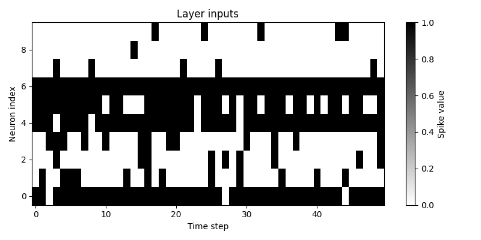
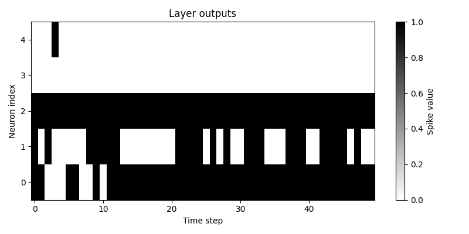

2. What is an SNN?
==================

SNN is shorthand for Spiking Neural Network. Spiking neural networks take their inspiration from biological neural
networks. The concept has been around for over a hundred years, the Lapicque neuron, created by Lois Lapicque in 1907,
is a simple direct electrical equivalent of the biological neuron. A capacitor gradually accumulates charge, until it
hits a threshold and suddenly sends off all the accumulated charge in an all-or-nothing event, that is, a spike.

Most modern SNN neurons are based around this concept: gradually collecting charge, and then suddenly firing when
reaching some threshold, thus emitting a spike. Leaky integrate and fire (LIF) neurons like this, are typically the
backbone behind most SNN models. They are simple in principle and are as powerful as the classic linear layers.

The astute reader may take note that linear layers in themselves aren't actually practical, modern ANNs work because of
the nonlinear functions interweaved in between the layers, and that is true. However, the LIF neuron gains its
nonlinearity from the charge accumulation process, the output is not linearly related to the input, the LIF neuron
always ever returns a 0 or 1 as it's output.

However, do not confuse the SNN models or LIF neurons with bitnet 1.58 byte models. Internally, the LIF neuron passes
the spike input through a weight matrix just like the classic linear layer to get the accumulated charge. For example,
say that we have some amount of inputs, and some amount of outputs, which represent the number of neurons in the
previous layer and this layer respectively. As input, we expect to receive spikes, and as output we also expect to
receive spikes. So, let's make some simple code to make an LIF neuron layer. First, we will just make it a single
timestep, non recurrent layer, and then we will turn it into one that is recurrent.

.. code-block:: python
   :linenos:

    import torch

    class LIF:
        def __init__(self, num_in, num_out):
            self.weight = torch.randn(num_out, num_in)
            self.threshold = torch.ones(num_out)

        def forward(self, in_spikes):
            current = torch.einsum("i, oi -> o", in_spikes, self.weight)
            out_spikes = (current > self.threshold).float()
            return out_spikes

With the way we did it, we get as input the spikes, we pass it through the weight matrix, we check if it passes some
threshold, and we output spikes. One simple but powerful way to think of it is that the layer is effectively a series
of logic gates or if statements. If we chain many logic gates together, it's not difficult how we can quickly begin to
make large branching trees of possibilities, encapsulating complex patterns. So let's run the following code and observe
the subsequent outputs of our layer.

.. code-block:: python
   :linenos:

   torch.manual_seed(42)

   i, o = 10, 5

   layer = LIF(i, o)

   for _ in range(5):
       random_input = torch.rand(i).round()
       layer_out = layer.forward(random_input)
       print(f"In: {random_input}, out: {layer_out}")

And we obtain the following output.

.. code-block::

   In: tensor([1., 0., 0., 0., 1., 1., 1., 0., 0., 0.]), out: tensor([1., 1., 1., 0., 0.])
   In: tensor([0., 1., 1., 1., 0., 0., 1., 0., 1., 0.]), out: tensor([0., 0., 1., 0., 0.])
   In: tensor([1., 0., 0., 1., 1., 0., 1., 1., 0., 0.]), out: tensor([0., 0., 1., 0., 0.])
   In: tensor([1., 0., 0., 0., 0., 1., 0., 0., 1., 0.]), out: tensor([0., 0., 0., 0., 0.])
   In: tensor([0., 0., 0., 0., 1., 1., 1., 0., 0., 0.]), out: tensor([0., 1., 1., 0., 0.])

Splendid. But as you can see, this is just a single timestep layer, in that it's just doing a check on the current
inputs and nothing else, this is effectively 5 distinct forward passes. So let's make it recurrent. For that we need the
following:

#. Accumulate the charge over time
#. Reset the accumulated charge so that we can fire again
#. Gradually decay the charge over time. This isn't strictly necessary, but if it's a learnable parameter then the
   neuron can learn to change it's scale of time importance to focus more on short term or long term events

Also, let's plot the outputs of our layer in a spike train: the spikes plotted along time. Since now we're accumulating
charge over time, it only makes sense that we have one input that we continuously show to the model. Better yet, we can
have a random tensor as input, but pass it through ``torch.bernoulli()`` to turn it from continuous values into spikes.
Then, if we accumulate the spikes over time and take the average, we expect to see that the averaged spike input is
close to the original tensor before being passed to ``torch.bernoulli()``. We can plot the inputs as well.

.. code-block:: python
   :linenos:

   class LIF:
	def __init__(self, num_in, num_out, decay):
		self.weight = torch.randn(num_out, num_in)
		self.decay = decay
		self.charge = torch.zeros(num_out)
		self.threshold = torch.ones(num_out)

	def forward(self, in_spikes):
		current = torch.einsum("i, oi -> o", in_spikes, self.weight)
		self.charge = self.charge * self.decay + current
		out_spikes = (self.charge > self.threshold).float()
		self.charge -= out_spikes * self.threshold
		return out_spikes

Let's also update the inference code to match. We are also plotting the inputs and outputs, and want to see if the
averaged ``torch.bernoulli()`` is close to the original tensor used.

.. code-block:: python
   :linenos:

   import tracetorch

   torch.manual_seed(42)

   i, o, d = 10, 5, 0.9

   layer = LIF(i, o, d)

   random_tensor = torch.rand(i)
   cumulative = torch.zeros_like(random_tensor)

   num_steps = 50

   inputs, outputs = [], []

   for _ in range(num_steps):
       random_input = torch.bernoulli(random_tensor)
       cumulative += random_input
       inputs.append(random_input)
       layer_out = layer.forward(random_input)
       outputs.append(layer_out)

   average_input = cumulative / num_steps
   print(f"True input: {random_tensor}")
   print(f"Average input: {average_input}")

   tracetorch.plot.spike_train(inputs, title="Layer inputs")
   tracetorch.plot.spike_train(outputs, title="Layer outputs")

Running this, and we get the following output and graphs:

.. code-block::

   True input: tensor([0.9147, 0.2036, 0.2018, 0.2018, 0.9497, 0.6666, 0.9811, 0.0874, 0.0041, 0.1088])
   Average input: tensor([0.9400, 0.2400, 0.1800, 0.2600, 0.9200, 0.7200, 1.0000, 0.1000, 0.0200, 0.1000])

Close enough, within the reasonable margin of error.

Congratulations. You have created the simplest recurrent LIF layer there is. It cannot train, nor does it have any
practical purpose, and the initialization of the weights is not nice, but good enough, you understand the principle of
an LIF neuron.