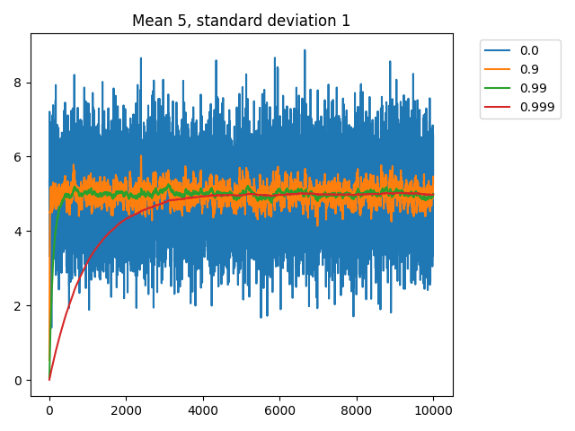
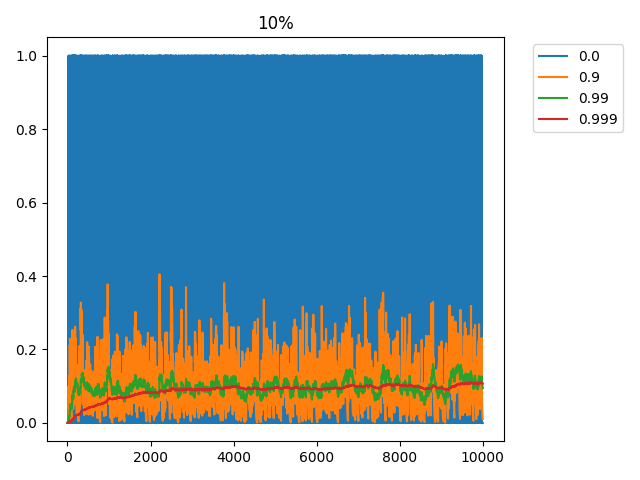
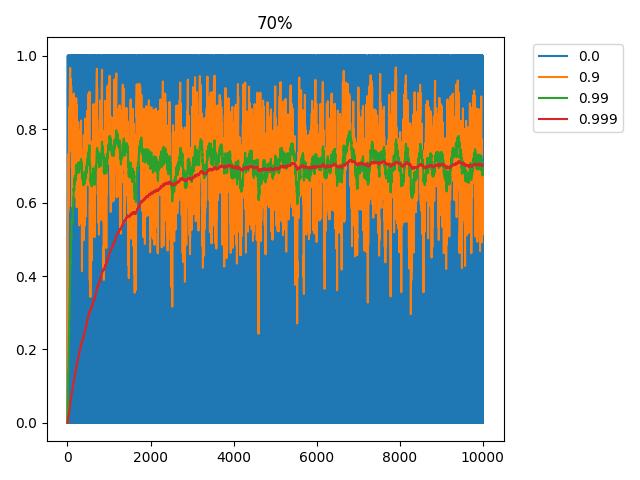

3. What is a trace?
===================

Now that you're familiar with what SNN models are, let's discuss what a trace is and how we can use it, since ``traceTorch``
largely depends on traces to work.

Mathematically, a trace is identical to a weighted average. This is useful in, say, RL for algorithms like REINFORCE,
where each timestep is rewarded or punished based on a weighted cumulative future reward with some decay factor. Say
that we have a list with rewards for each timestep, and a decay factor ``d``, like 0.5. We can hence calculate the
cumulative weighted future reward as such:

.. code-block:: python
   :linenos:

    def discounted_cumulative_sum(values, d):
        n = len(values)
        result = [0.0] * n
        running_sum = 0.0

        for i in reversed(range(n)):
            running_sum = values[i] + d * running_sum
            result[i] = running_sum

        return result

And if we do:

.. code-block:: python
   :linenos:

    random_list = [0, 1, -1, 2, 5, -3]
    print(f"dcs: {discounted_cumulative_sum(random_list, 0.5)}")

We get:

.. code-block::

    dcs: [0.71875, 1.4375, 0.875, 3.75, 3.5, -3.0]

Now, we can use this list to reward or punish the actions the model did. So for example, the second last action yielded
an instant reward of 5, but because the next action resulted in a reward of -3, the effective cumulative reward is
lower, at 3.5, while the second last action is technically even better, because that action led to an even better action
made in the future.

Now take note how we calculated this cumulative discounted sum. We reversed the list, and kept a running average where
at each step we scaled it by the decay and added the input. So let's generalize this formula to some simple variables:

#. t = trace, the running average
#. i = input, the value we add into the trace
#. d = decay, the value we decay the trace by at each step. Should be bound between [0, 1] so that it decays, and not
   expands or oscillates

Hence at each step we do ``t = t * d + i``. Recall that for our above function, we reversed the list because we were
looking into the cumulative *future* rewards, but let's change our strategy. Let's keep a running trace of the past.
This way, on the fly, at any point in time, we have the trace kept for whatever we observed in the past.

In the context of REINFORCE, this really isn't practical as now we would be rewarding or punishing the model based on
the actions it did beforehand, in no way is this an indicator of the goodness of the action. However, we can still do
some interesting stuff.

For example, let's assume that this trace is unchanging and has stabilized. That is to say, at every timestep, we decay
it and add the input, but the trace doesn't change. We can say *"given a decay and a stabilized trace, what is the input
required on average to get the observed trace?"*. Let's follow through.

.. code-block::

    t * d + i = t
    t * d - t + i = 0
    t * (d - 1) + i = 0
    i = -t * (d - 1)
    i = t * (1 - d)

Now we have a generalized formula ``i = t * (1 - d)`` to find out the average input given a trace and some decay. Let's
test it out in practice, seeing how various values of ``d`` affect the calculated average input ``i``. We are going to
use ``tracetorch.plot.MeasurementManager()`` for exactly that. Internally, it maintains multiple traces with various decay
values, initialized to ``[0, 0.9, 0.99, 0.999]``. At each timestep it implements the input into each trace, recalculates
the ``i`` value, and saves that. Then we can plot the ``i`` values over time. For the sake of simplicity, let's feed
into it a number with a mean of 5 and a standard deviation of 1, that is to say ``torch.randn(1) + 5``. Let's also do
this for 10000 timesteps.

.. code-block:: python
   :linenos:

   import torch, tracetorch

   torch.manual_seed(42)

   measurement_manager = tracetorch.plot.MeasurementManager(title="Mean 5, standard deviation 1")

   for i in range(10000):
       random = torch.randn(1) + 5
       measurement_manager.append(random)

   measurement_manager.plot()

As a result we get this:

As you can see, the closer our decay is to 1, the slower that ``i`` stabilizes, or rather, re-stabilizes. We start out
with the trace set to 0, but it could've been anything beforehand. The speed at which the trace adapts to new
information depends only on the value ``d``, not the actual value of the trace stored beforehand. This makes sense,
because the difference between 0.9 and 0.99 is actually 10x, as the resultant trace is 10 times bigger, and hence more
time is needed to accumulate enough for the trace. A larger ``d`` value also smooths the curve significantly, after all,
we're effectively taking the average of a lot more numbers. A nice way to think of it is that the value ``d`` dictates
the importance in time. High ``d`` looks at long term trends, while a low ``d`` better observes rapid changes.

Now let's assume that we are storing this trace inside an LIF layer. As input, the layer expects spikes, so either a 1
or 0, so the running average would be somewhere in between. Interestingly, since the output is always a 1 or 0, the
average is actually the firing frequency. So our calculated value for `i` is actually the calculated firing frequency
of the neuron. Keep in mind that all this is done on the fly in constant memory and time consumption. For fun, let's
see how the graph would look like for biased neurons, one that fires only 10% of the time and another one that fires 70%
of the time.

.. code-block:: python
   :linenos:

   import torch, tracetorch

   torch.manual_seed(42)

   p1_measurement_manager = tracetorch.plot.MeasurementManager(title="10%")
   p7_measurement_manager = tracetorch.plot.MeasurementManager(title="70%")

   p1, p7 = torch.tensor(0.1), torch.tensor(0.7)

   for i in range(1000):
       r1, r7 = torch.bernoulli(p1), torch.bernoulli(p7)
       p1_measurement_manager.append(r1)
       p7_measurement_manager.append(r7)

   p1_measurement_manager.plot()
   p7_measurement_manager.plot()

We get the following graphs:

As you can see, everything in life is about balance. The line graphs presented are visually most useful and telling with
a decay factor of 0.99, 0.9 is quite too noisy and hard to discern the pattern while 0.999 is far too slow. However, it
all depends on the perspective. Perhaps for a model that is running for millions of timesteps, a decay of 0.999 is
actually just right to see the trend emerge? Or you could use ``tracetorch.plot.MeasurementManager()`` to comfortably
keep track of the running loss, or accuracy of a model while training. Accuracy and loss of an epoch is useful for
testing, but not during training, as that can heavily skew one way or another, so by keeping a couple traces with
various decay values you can actually infer more useful information.